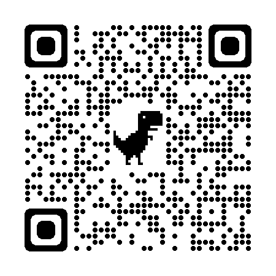

## Cafeteria Lunna

Um site básico desenvolvido para uma cafeteria, com o objetivo de praticar HTML, CSS e JavaScript.

## Autor
Nicoli Santos 

## Funcionalidades

- Página inicial com banner carrosel e apresentação da cafeteria

- Menu de produtos em pdf (cafés, doces, salgados, etc.)

- Seção com os produtos mais vendidos
  
- Informações de contato com mapa incorporado (fictícias)

## Tecnologias utilizadas

HTML5

CSS3

JavaScript

## Objetivo do projeto

Projeto feito para fins educacionais no curso técnico de Informática, com foco em estruturação de páginas web e boas práticas de layout.

## Site responsivo
 Visite também pelo seu smartphone!  
 
 

